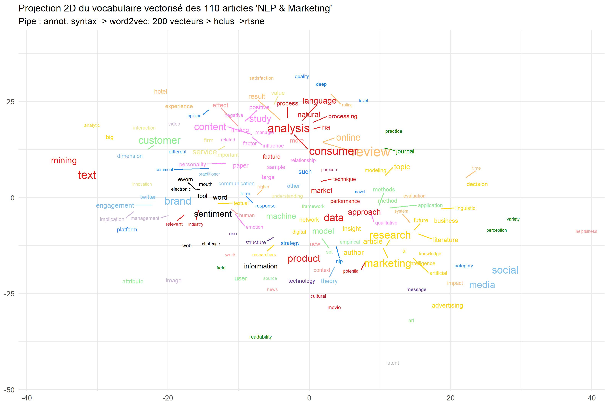

```{r 00, echo = TRUE,message=FALSE, warning=FALSE}
knitr::opts_chunk$set(echo = TRUE,message=FALSE, warning=FALSE)
library(tidyverse)
library(Rtsne)
library(ggrepel)
library(ggwordcloud)
library(quanteda)
library(quanteda.textstats)
library(quanteda.textmodels)
library(word2vec)
library(ape)
library(cowplot)

theme_set(theme_minimal()+theme(plot.title = element_text(size=12)))
```

## Data

Une recherche sur (Marketing | consumer) & ( NLP | text analysis) sur Business Source Premier et quelques ajustements.

Un corpus de 110 papiers pour démarrer. n= `nrow(df)` .


```{r 01}
df <- read_csv("NLP Marketing and consumer - dataforR.csv") %>% 
  filter(!is.na(text))

head(df,5)
```

## Analyse quantitative

Conduite à la fois dans le temps et à travers les sources.
```{r 03, echo=FALSE, fig.width=10}
t0 <-as.data.frame(prop.table(table(df$review)))
g01<-ggplot(t0,aes(x=reorder(Var1, Freq), y=Freq))+
  geom_bar(stat="identity", fill="Skyblue")+
  coord_flip()+
  labs( title="Marketing et NLP : Nombre d'articles par revue et par an", y="Proportion", x= NULL)
g01
t1<-as.data.frame(table(df$year))

g02<-ggplot(t1, aes(x=Var1, y=Freq, group=1))+ 
  geom_smooth(fill="Gold1", alpha=.2)+
  geom_line(stat="identity", size=1) + 
  labs( caption=paste("Total =",nrow(df)), y=NULL, x=NULL)

plot_grid(g01, g02, labels = c('', ''), label_size = 10, ncol=2,  rel_widths =  c(1,1))

ggsave(filename="quant.jpeg", plot=last_plot(), width = 27, height = 18, units = "cm")
```

## Keywords

Cette analyse demande un fine tuning manuel sur les redondances. Il doit être qualitatif, on ne doit pas perdre une nuance mais réduire au plus les singletons.

```{r user}

#construction du tableau
df_key<- df %>% 
  mutate(keywords=paste0(keywords," , ",methods, " , ", fields))%>%
  select(id, keywords)%>%
  separate(keywords, sep=",", into=c("A1","A2","A3","A4","A5","A6","A7","A8","A9","A10", "A11", "A12", "A13", "A14", "A15", "A16", "A17","A18", "A20", "A21", "A22"))%>%
  pivot_longer(-id, names_to="Rang", values_to = "keywords") %>%
  filter(!is.na(keywords)) %>% 
  mutate(keywords=str_trim(keywords,side ="both"),keywords=tolower(keywords))


#recodage manuel des key words

df_key$keywords[df_key$keywords=="ai"]<-"artificial intelligence"
df_key$keywords[df_key$keywords=="artificial intelligence (ai)"]<-"artificial intelligence"
df_key$keywords[df_key$keywords=="automated analysis of text"]<-"automated text analysis"
df_key$keywords[df_key$keywords=="automated textual analysis"]<-"automated text analysis"
df_key$keywords[df_key$keywords=="natural language processinf"]<-"natural language processing"
df_key$keywords[df_key$keywords=="natural language processing (nlp)"]<-"natural language processing"
df_key$keywords[df_key$keywords=="natural language processing (nlp)-based approach"]<-"natural language processing"
df_key$keywords[df_key$keywords=="nlp tools"]<-"nlp"
df_key$keywords[df_key$keywords=="online review"]<-"online reviews"
df_key$keywords[df_key$keywords=="online shopping review"]<-"online reviews"
df_key$keywords[df_key$keywords=="review"]<-"online reviews"
df_key$keywords[df_key$keywords=="reviews"]<-"online reviews"
df_key$keywords[df_key$keywords=="online customer reviews"]<-"online reviews"
df_key$keywords[df_key$keywords=="review data"]<-"online reviews"
df_key$keywords[df_key$keywords=="automated text analysys"]<-"automated text analysis"
df_key$keywords[df_key$keywords=="automated content analysis"]<-"automated text analysis"
df_key$keywords[df_key$keywords=="word association"]<-"word association analysis"
df_key$keywords[df_key$keywords=="machine learning"]<-"ml"
df_key$keywords[df_key$keywords=="latent dirichlet allocation (lda)"]<-"lda"
df_key$keywords[df_key$keywords=="latent dirichlet allocation"]<-"lda"
df_key$keywords[df_key$keywords=="latent dirichlet allocation"]<-"lda"
df_key$keywords[df_key$keywords=="movies"]<-"movie"
df_key$keywords[df_key$keywords=="consumer-generated content"]<-"user-generated content"
df_key$keywords[df_key$keywords=="consumer-generated media"]<-"user-generated content"
df_key$keywords[df_key$keywords=="user generated content"]<-"user-generated content"
df_key$keywords[df_key$keywords=="user generated data"]<-"user-generated content"
df_key$keywords[df_key$keywords=="litterature review"]<-"literature review"
df_key$keywords[df_key$keywords=="application programming interface"]<-"api"
df_key$keywords[df_key$keywords=="word of mouth"]<-"ewom"
df_key$keywords[df_key$keywords=="natural language processing"]<-"nlp"
# a compléter plus systématiquement

foo<-df %>% select(id, year)

foo<-df_key %>% left_join(foo)%>%
  filter(keywords!="na")%>% 
  filter(nchar(keywords)>1)%>%
  group_by(keywords)%>%
  summarise(n=n(), year=mean(year, na.rm=TRUE))

ggplot(foo%>%filter(n>2),aes(x=reorder(keywords,n), y=n))+
  geom_bar(stat= "identity", aes(fill=year))+
  coord_flip()+ labs( x=NULL, y="Fréquence", title = "Mots clés les plus fréquents")+  scale_fill_gradient(low="yellow", high="dodgerblue4")

ggsave(filename="keywords.jpeg", plot=last_plot(), width = 27, height = 18, units = "cm")

foo2<-df_key %>% filter(keywords!="na")%>% filter(nchar(keywords)>1)%>%
  select(-Rang)%>% 
  group_by(id,keywords)%>%
  summarise(n=n())

foo2<- foo2 %>% pivot_wider(id,names_from = "keywords", values_from ="n" )

foo2<- foo2 %>% replace(is.na(.),0)

#projection tsne

foo3<-t(foo2)
tsne_out <- Rtsne(foo3,perplexity = 20, dim=2,  check_duplicates = FALSE) # Run TSNE
tsne_out2<-as.data.frame(tsne_out$Y)
keywords<-rownames(foo3)

tsne_out3<-cbind(tsne_out2, keywords) 
tsne_out3<- merge(tsne_out3,foo)

#foo2
tsne_out3%>% filter(n>0) %>%
  ggplot(aes(x=V1, y=V2, label=keywords))+
#  geom_point(aes(size=n), alpha=.5)+
  geom_text_repel(aes(label=ifelse(n>1,keywords,""),size=n, color=year),  max.overlaps =50)+
  theme(legend.position="none")+
  labs(title=" Projection Tsne des mots clés",x=NULL, y=NULL)+  
  scale_color_gradient2(low="Gold", high="dodgerblue4")
  
ggsave(filename="keywords_map.jpeg", plot=last_plot(), width = 27, height = 18, units = "cm")
```


## Niveau article

First concatenate title+ abstract + keywords

```{r collocation}
df$Texte<-paste(df$title, " . ", df$text, " . ", df$keywords," . ",  df$fields)

corp<-corpus(df$Texte)

toks<- tokens(corp, remove_punct = TRUE,tolower=TRUE)

tstat_col_caps <- toks %>% 
                  textstat_collocations(min_count = 3)%>%arrange(desc(count))

head(tstat_col_caps, 50)
```

question : comment intégrer les collocations dans le traitement des POS ? 

Une solution simple, prendre en compte les adjectifs

### Annotations


```{r pos}
library(udpipe)
#annotations
eng <- udpipe_download_model(language = "english") #ne faire que la première fois
udmodel<- udpipe_load_model(file = "english-ewt-ud-2.5-191206.udpipe")

t1<-Sys.time()
UD <- udpipe_annotate(udmodel, x=df$Texte, trace =20)
t2<-Sys.time()
t<-t2-t1
print(t)

UD <- as.data.frame(UD)

foo<-UD %>%
  select(doc_id,paragraph_id, sentence, token_id,token,lemma, upos,feats, dep_rel,head_token_id)
```
### embeddings

```{r vecteur}

#on filtre adverbes adjectifs verb et non communs
updated_vocab <- foo %>%  
  filter(upos %in% c('NOUN', 'PROPN', "ADJ")) %>% mutate(lemma=tolower(lemma))

updated_vocab2<- updated_vocab %>%
  group_by(lemma)%>%
  summarise(n=n())

#on reconstitue le texte filtré
text2<-updated_vocab %>%
 group_by(doc_id) %>%
 summarise(description = paste(lemma, collapse = " "))


#on vectorise
set.seed(123456789)
model <- word2vec(x = text2$description, 
                  type = "skip-gram", 
                  window = 20, 
                  dim = 200, 
                  iter = 100
                  )
embedding <- as.matrix(model)

#test sur review
lookslike <- predict(model, c("lda"), type = "nearest", top_n = 20)
lookslike
```

### clustering

```{r hclust1}

#on typologise des termes

library(fastcluster) #pour aller plus vite
distance<-as.dist(1 - cor(t(embedding)))
arbre <- hclust(distance, method = "ward.D2")
plot(arbre,  xlab = "", ylab = "", sub = "", axes = FALSE, hang = -1)
rect.hclust(arbre,16, border = "green3")

group<- as.data.frame(cutree(arbre, k = 16))
group<- group %>% 
  rownames_to_column(var="lemma")%>%
  rename(group=2)%>%
  left_join(updated_vocab2, by="lemma")

library(ggwordcloud)
ggplot(group, aes(label = lemma, size = n, color=n)) +
  geom_text_wordcloud_area() +
  scale_size_area(max_size = 10) +
  facet_wrap(vars(group), ncol=4)

ggsave(filename="cluster_word.jpeg", plot=last_plot(), width = 27, height = 18, units = "cm")


plot(as.phylo(arbre), type = "unrooted", cex = 0.3, no.margin = TRUE)


tsne_out <- Rtsne(embedding,perplexity = 8, dim=2) # Run TSNE
tsne_out2<-as.data.frame(tsne_out$Y)
#lemma<-rownames(embedding)

tsne_out3<-cbind(tsne_out2,group) %>%
  left_join(updated_vocab2) %>% filter(n>4)


c25 <- c(
  "dodgerblue2", "#E31A1C", # red
  "green4",
  "#6A3D9A", # purple
  "#FF7F00", # orange
  "black", "gold1",
  "skyblue2", "#FB9A99", # lt pink
  "palegreen2",
  "#CAB2D6", # lt purple
  "#FDBF6F", # lt orange
  "gray70", "khaki2",
  "maroon", "orchid1", "deeppink1", "blue1", "steelblue4",
  "darkturquoise", "green1", "yellow4", "yellow3",
  "darkorange4", "brown"
)

library(ggrepel)
tsne_out3%>%
  ggplot(aes(x=V1, y=V2, label=lemma))+
  geom_text_repel(aes(label=ifelse(n>14,lemma,""),size=n,color=as.factor(group)),max.overlaps=20)+
    labs(title="Projection 2D du vocabulaire vectorisé des 110 articles 'NLP & Marketing' ",
       subtitle="Pipe : annot. syntax -> word2vec: 200 vecteurs-> hclus ->rtsne",
       x= NULL, y=NULL)+ 
  scale_color_manual(values=c25) +  
  theme(legend.position = "none") 

ggsave(filename="vector_word.jpeg", plot=last_plot(), width = 27, height = 18, units = "cm")

```
## doc2 vec

Vectorize papers

```{r vector4, echo=FALSE}

#titre<-UD %>%group_by

x      <- data.frame(doc_id           = text2$doc_id, 
                     text             = text2$description, 
                     stringsAsFactors = FALSE)

x$text <- txt_clean_word2vec(x$text, tolower=TRUE)


emb <- as.data.frame(doc2vec(model, x$text,  split = " ",type = "embedding"))%>%
  drop_na()

df<-df %>%
  mutate(Author=paste0(str_extract(auteurs, "[^;]+")," ",year),
         Author=paste0(str_extract(Author, "[^,]+")," ",year))

#on typologise des termes
library(fastcluster) #pour aller plus vite

distance<-as.dist(1 - cor(t(emb)))


arbre <- hclust(dist(distance), method = "ward.D")

plot(arbre,  xlab = "", ylab = "", sub = "", axes = FALSE, hang = -1)
rect.hclust(arbre, 5, border = "green3")
group<- cutree(arbre, k =5)

tsne_out <- Rtsne(emb,perplexity = 5, dim=2, check_duplicates=FALSE) # Run TSNE
tsne_out2<-as.data.frame(tsne_out$Y)

foo<-UD%>%
  group_by(doc_id)%>%
  summarise(title=first(sentence))%>%
  mutate(sentence2=str_sub(title,1,80))

tsne_out3<-cbind(tsne_out2,group, foo,df[,34]) 


means <- tsne_out3 %>%
    group_by(group) %>%
    summarise(mean_F1 = mean(V1),
              mean_F2 = mean(V2))

tsne_out3%>%
  ggplot(aes(x=V1, y=V2, group=group))+
  geom_point(aes(color=as.factor(group)), alpha=.5)+
  geom_text_repel(aes(label=str_wrap(Author,30)),  size=1.5) +
  labs(title="Projection 2D des 106 articles 'NLP & Marketing' vectorisés",
       subtitle="Pipe : annot. syntax -> word2vec: 200 vecteurs-> doc2vec-> hclus ->rtsne",
       x= NULL, y=NULL)+ scale_color_discrete()+  theme(legend.position = "none")


ggsave(filename="vector_article.jpeg", plot=last_plot(), width = 27, height = 18, units = "cm")


```

## Working in a common space

words and text in the common space of vectors reduced to a 2D projection. 


```{r vector6}
emb<-cbind(df[,34],emb) 
emb[7,1]<-"Lee 2011b"
emb[15,1]<-"Tang 2015b"

emb<-as.data.frame(emb) %>% 
  column_to_rownames(var="Author")

vector_tot<-rbind(embedding, emb)

tsne_out <- Rtsne(vector_tot,perplexity = 8, dim=2) # Run TSNE
tsne_out2<-as.data.frame(tsne_out$Y)
tsne_out2[1:505,3]<-"word"
tsne_out2[506:615,3]<-"doc"

w<-as.data.frame(rownames(emb))%>%rename(tag=1)
d<-as.data.frame(rownames(embedding))%>%rename(tag=1)
x<-rbind(d,w)
tsne_out3<-cbind(tsne_out2,x)
# tsne_out3<-cbind(tsne_out2) %>%   left_join(updated_vocab2) %>%   filter(n>4)


library(ggrepel)
tsne_out3%>%
  ggplot(aes(x=V1, y=V2, label=tag, group=V3))+
  geom_text_repel(aes(label=tag,color=V3),max.overlaps=20, size=2)+
    labs(title="Projection 2D du vocabulaire vectorisé des 110 articles 'NLP & Marketing' ",
       subtitle="Pipe : annot. syntax -> word2vec: 200 vecteurs-> hclus ->rtsne",
       x= NULL, y=NULL)+ 
  theme(legend.position = "none") 

ggsave(filename="full.jpeg", plot=last_plot(), width = 27, height = 18, units = "cm")
```
